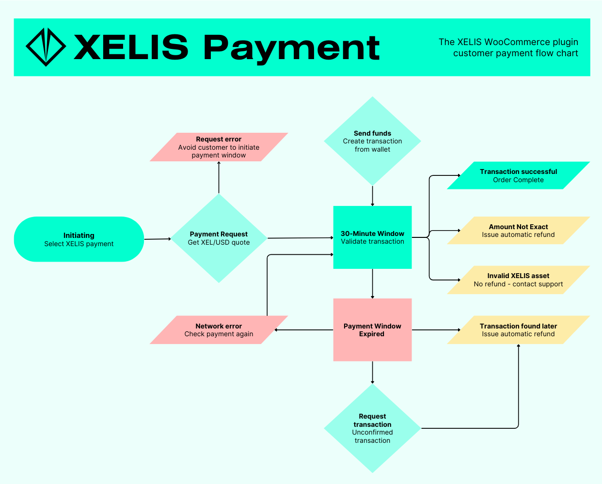

# XELIS WooCommerce plugin

Accept XELIS as a means of payment for the most popular WordPress eCommerce platform.
This plugin is designed to be simple to integrate for store owner and seamless to use for customers.

## Are you a store owner?

You want to integrate the XELIS payment plugin into your store?
[Check out the User Manual](/user_manual/store_owner_user_manual.md)

## Are you a customer?

You are having trouble using the plugin or you want to understand how it works before proceeding?
[Check out the User Manual](/user_manual/customer_user_manual.md)

## Customer payment process

Initiating

1. At checkout the customer goes to the payment options and select 'XELIS Payment' (if available for the items in his cart - configurable).
2. The plugin will request the USD/XEL quote and initiate a 30min payment window (configurable).
3. During that time the customer can send funds to the integrated address displayed on screen.
4. He must also send the exact amount of XEL specified for the order and wait for the payment response.

Payment Response

- The transaction is valid/confirmed and the order is complete.
- The amount is not exact and an automatic refund is issued.
- The transaction is not a valid XELIS asset (no refund is issued and the customer can contact store support to resolve the situation).
- The payment window expiresm, and if the a transaction is found, the plugin will issue a refund (a button is also available for the customer to check for past unconfirmed transaction).
- If there are any network errors during that process, errors are logged for the store owner to help fix the situation (the payment window is not reset and retries for the entire time of the payment window).

